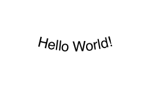

# CurvedLabel

UIKit label for drawing attributed text along a circular path.


---

## Example



## Usage

```swift
import UIKit
import CurvedLabel

let label = CurvedLabel()
label.frame = CGRect(x: 0, y: 0, width: 300, height: 300)

label.textColor = .black
label.radius = 120
label.rotation = 180
label.textInside = true
label.attributedText = NSAttributedString(
  string: "Hello World!",
  attributes: [
    .foregroundColor: UIColor.black
  ]
)
```

`radius` controls the circular path in points and is clamped to `0` when a
negative value is assigned. When `radius` is greater than `0`, Auto Layout uses
at least the circle diameter for `intrinsicContentSize`, plus the label font's
line height when text is drawn outside the circle. `rotation` is measured in
degrees, and `textInside` switches the glyphs to the inner side of the circle.

## Documentation

- [DocC Documentation](https://docs.gorani.me/CurvedLabel/documentation/curvedlabel/)

## Installation

### Swift Package Manager

Add CurvedLabel to your package dependencies.

```swift
dependencies: [
  .package(url: "https://github.com/swift-man/CurvedLabel.git", from: "1.0.0")
]
```
